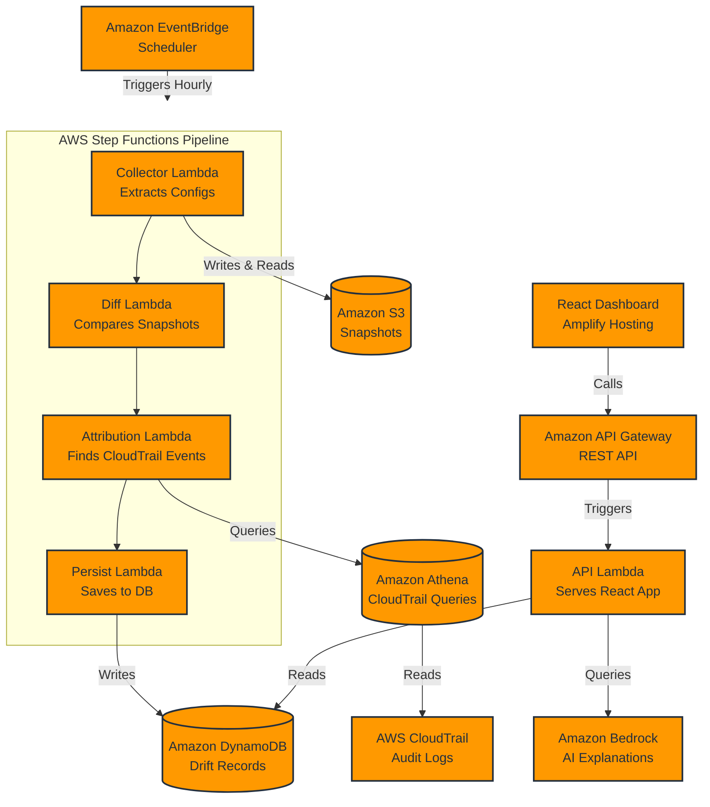
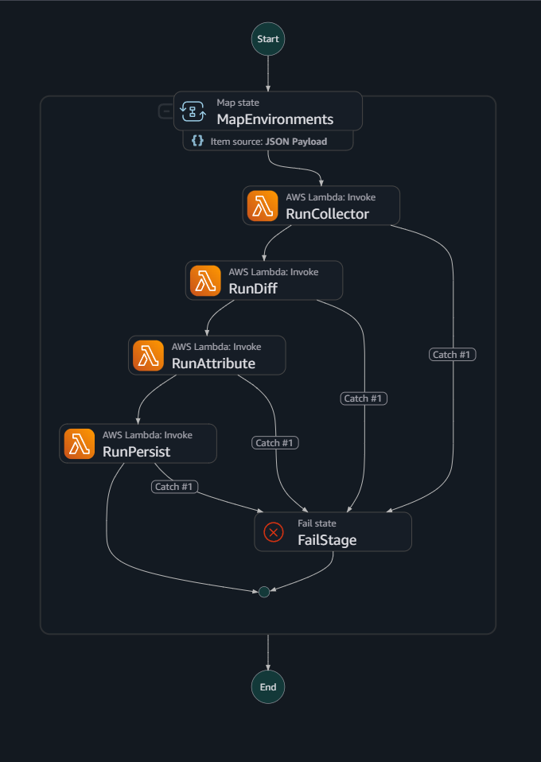

# DriftLens

DriftLens is an automated configuration drift detection and attribution platform built for AWS. It captures point-in-time snapshots of AWS resources across environments, detects configuration drift, and traces the drift back to the exact CloudTrail event that caused it.

## Architecture

### Step Functions Pipeline Graph
*(Please replace this placeholder with the `step-functions-graph.png` screenshot from DL-014)*

## Getting Started

1. Deploy the backend via the automated setup scripts.
2. Ensure CloudTrail is logging management events to S3.
3. Start the EventBridge Scheduler rule to run the Step Functions pipeline.
