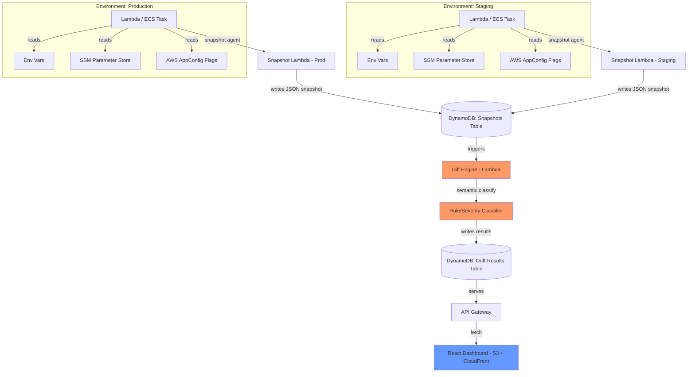

# DriftLens — Runtime Config Drift Detector
## Full Implementation Plan (4-Day Build)

---

## 1. The One-Line Pitch

**"Your staging and prod environments look identical on paper — DriftLens shows you where they've silently diverged in reality, before it causes an incident."**

Not IaC drift (Terraform vs. cloud state — solved). Not file-based .env diffing (solved, shallow). **Effective runtime config drift** — the actual resolved values inside a running process, semantically diffed across environments.

---

## 2. Problem Recap (for your own clarity, and for the blog later)

Docker solves artifact drift: same image, same dependencies, same OS libs everywhere. It does **not** solve what's injected into that container at runtime per environment — env vars, feature flags, Parameter Store values, in-memory overrides, manual hotfixes. That's the layer where "works in staging, breaks in prod" actually lives, and it's invisible to Docker, Terraform, and most .env-file linters.

Known adjacent tools and why they don't cover this:
- `env-check` — validates `.env` files, explicitly does not do cross-environment diffing (stated in its own docs)
- `pycheckem` — snapshots + diffs runtime environments, but Python-only
- `tako-cli` (`tako drift`) — diffs *config vs. running services*, not *environment A vs. environment B at the resolved-value level*
- Convox / Upsun / Applad — prevent drift by making you migrate to their platform and generate every environment from one declarative source. They don't diagnose drift in an *existing*, already-drifted stack you don't want to migrate off of.

**Your wedge**: diagnostic tool for teams with existing infra who won't migrate platforms — snapshot the real resolved config from running AWS services, diff semantically (type-aware, severity-scored), not just textually.

---

## 3. System Architecture



**Why this shape**: snapshot agents are dumb and cheap (just read + upload), all the actual IP (semantic diffing + severity classification) lives in one isolated Lambda you can iterate on fast without touching anything else. This separation also makes for a very clean architecture diagram to show judges.

---

## 4. Tech Stack

| Layer | Choice | Why |
|---|---|---|
| Snapshot agent | Python (`boto3`) as a Lambda layer/sidecar | Fast to write, native AWS SDK access |
| Storage | DynamoDB (2 tables: `snapshots`, `drift_results`) | Serverless, zero setup, on-demand billing = free tier friendly |
| Diff engine | Python Lambda | Reuse same runtime as snapshot agent, share code |
| Semantic classification | Rule-based (not ML) — see §6 | Faster to build, easier to explain in blog/demo, fully deterministic for a live demo (no flaky model outputs) |
| API | API Gateway (REST, simple) | Standard, quick to wire to Lambda |
| Frontend | React + Tailwind, hosted on S3 + CloudFront (or just Amplify Hosting) | Fast to stand up, "Ship It" track already nudges you toward Amplify |
| Config sources targeted | Env vars, SSM Parameter Store, AWS AppConfig | All AWS-native, makes "Built on AWS" criterion airtight |

**Deliberate scope cuts** (do not build these — say so explicitly if asked):
- No multi-cloud support — AWS only, on purpose
- No real-time streaming diff — snapshot-triggered (button or schedule) is enough for a 4-day demo
- No auth/multi-tenancy — single demo account is fine
- No support for arbitrary config file formats — env vars + SSM + AppConfig only

---

## 5. Data Model

**`snapshots` table**
```json
{
  "snapshot_id": "uuid",
  "environment": "staging | production",
  "timestamp": "ISO8601",
  "resolved_config": {
    "env_vars": { "FEATURE_NEW_CHECKOUT": "true", "DB_HOST": "staging-db.xxx" },
    "ssm_params": { "/app/api_timeout": "30", "/app/max_retries": "3" },
    "appconfig_flags": { "new_checkout_enabled": true, "beta_ui": false },
    "meta": { "runtime_version": "node18.x", "region": "ap-south-1" }
  }
}
```

**`drift_results` table**
```json
{
  "comparison_id": "uuid",
  "env_a": "staging",
  "env_b": "production",
  "timestamp": "ISO8601",
  "diffs": [
    {
      "key": "env_vars.FEATURE_NEW_CHECKOUT",
      "value_a": "true",
      "value_b": null,
      "severity": "critical",
      "reason": "Boolean feature flag present in staging, missing in production — likely unshipped backport"
    },
    {
      "key": "meta.region",
      "value_a": "ap-south-1",
      "value_b": "us-east-1",
      "severity": "expected",
      "reason": "Region is expected to differ between environments"
    }
  ]
}
```

---

## 6. The Diff Engine — Your Actual IP (spend the most time here)

Don't naive string-diff. Classify each key into buckets:

1. **Expected-to-differ keys** (allowlist): hostnames, region, account ID, ARNs, resource names containing env name — flag as `info`, not `warning`.
2. **Type-sensitive comparison**: `"true"` (string) vs `true` (bool) vs missing — treat "present in A, absent in B" as **higher severity** than "different value in both."
3. **Severity scoring rules** (simple, explainable, deterministic — good for live demo):
   - **Critical**: boolean feature flag present in one env, missing in the other
   - **High**: numeric config differs by >20% (timeout, retry count, rate limits)
   - **Medium**: string value differs, not on the expected-diff allowlist
   - **Info**: key is on the allowlist (region, hostnames, etc.)
4. Optional stretch (if time on Day 3): use Bedrock to generate a plain-English explanation of *why* a specific drift might be dangerous, given the key name. This is a nice-to-have that plays well in the demo, not a dependency for the core function to work.

Write this as a standalone, testable Python module first, with unit tests on hardcoded fake snapshots — do this before wiring up any AWS Lambda plumbing, so you have a working core even if AWS setup takes longer than expected.

---

## 7. Day-by-Day Plan (Team of 2–3)

### Day 1 — Foundations + Core Diff Logic
- **Person A**: Set up AWS scaffolding — 2 Lambda functions (snapshot, diff), 2 DynamoDB tables, IAM roles, API Gateway skeleton. Get a "hello world" snapshot writing to DynamoDB by end of day.
- **Person B**: Build the diff engine as a pure Python module, fully unit-tested against hardcoded fake JSON snapshots (no AWS dependency yet). This is the heart of your USP — get it right in isolation first.
- **Person C** (if 3): Scaffold the React dashboard shell, set up S3/Amplify hosting, get a static "Hello DriftLens" page deployed and reachable via URL. Also set up a demo scenario: two toy Lambda functions ("staging-service", "prod-service") with genuinely divergent config (a feature flag, a numeric timeout, a missing SSM param) — you need believable drift to detect.
- **End of day checkpoint**: snapshot Lambda writes real data to DynamoDB; diff engine works standalone; dashboard shell is live with a URL.

### Day 2 — Wire It Together
- Connect snapshot agent to read real env vars + SSM Parameter Store + AppConfig from the two demo services.
- Plug the tested diff engine into the diff Lambda, triggered by API Gateway call or DynamoDB Streams (simpler: API Gateway POST `/compare?envA=staging&envB=production`).
- Wire dashboard to call the API, render raw diff JSON (ugly is fine today — table, no styling yet).
- **End of day checkpoint**: click a button in the (ugly) UI → see real, correctly-classified drift results end to end.

### Day 3 — UI Polish + Severity Visualization + Stretch Features
- Build the actual UI: side-by-side environment cards, drift rows color-coded by severity (red/orange/yellow/gray), filter by severity.
- Add the "why this matters" explanation per diff (rule-based text, or Bedrock-generated if time allows).
- Add a history view — past comparisons, so it looks like a real tool, not a one-shot script.
- Polish demo scenario: make sure the fake drift you're detecting tells a clear story (e.g., "a feature flag flip that would have caused a partial checkout rollout" — mirrors the real Convox example, good pull for your blog too).
- **End of day checkpoint**: full polished loop works, demo scenario is compelling and reproducible on demand.

### Day 4 — Blog, Demo Video, Buffer
- **Morning**: buffer time for anything broken from Day 3 (there always is something) — do not schedule new features here.
- **Midday**: write the blog post — problem statement, why Docker/IaC tools don't solve this, your architecture, what you learned (AppConfig if new to you, semantic diffing design decisions, any AWS gotchas you hit).
- **Afternoon**: record the 3-minute demo video (script below).
- **Evening**: final submission checks — repo README, architecture diagram embedded, AWS services clearly named, video uploaded.

---

## 8. Demo Video Script (3 minutes — no live demo, this IS the pitch)

1. **0:00–0:25 — The hook**: "This is a real story: a team ships a feature flag change to staging, tests pass, forgets to backport it to prod. Nobody notices until users see a broken checkout." (Show a simple diagram of two "identical-looking" environments.)
2. **0:25–0:50 — The gap**: "Docker solves 'same code everywhere.' Terraform solves 'same infra everywhere.' Nothing solves 'same *runtime config* everywhere' — that's the layer where this bug lives." (Quick visual: Docker ✅, Terraform ✅, Runtime config ❌)
3. **0:50–1:30 — The tool, live**: Show the dashboard. Trigger a comparison between your two demo services. Watch the drift results populate — highlight the critical (red) flag divergence front and center.
4. **1:30–2:10 — The "why"**: Click into the flagged item, show the semantic explanation ("boolean flag present in staging, missing in production — likely an unshipped backport"). Show a second, lower-severity diff (e.g., region difference) correctly classified as "expected," proving your classifier isn't just noisy string-diffing.
5. **2:10–2:40 — Architecture + AWS**: 10-second architecture diagram walkthrough — Lambda, DynamoDB, SSM Parameter Store, AppConfig, API Gateway, Amplify/S3+CloudFront. Name the services explicitly.
6. **2:40–3:00 — Close**: "We built this in 4 days, and we learned [X] about AWS AppConfig / semantic diffing along the way. This is a diagnostic tool for teams who won't migrate to a new platform just to catch drift they already have." End on the URL/dashboard.

---

## 9. Blog Post Outline

1. **The incident that inspired this** (use the feature-flag-backport story — it's real and relatable, cite Convox's identical example if you want external validation that this is a known class of failure)
2. **Why existing tools don't cover this** — Docker (artifact drift only), Terraform/AWS Config (infra drift only), env-check (explicitly no cross-env diff), pycheckem (Python-only) — be specific and honest, this is what makes the blog credible instead of hand-wavy
3. **Architecture decisions and why** — why DynamoDB not RDS, why rule-based classification not ML (explainability + demo reliability), why AppConfig
4. **What we learned** — be honest and specific: e.g., "we hadn't used AWS AppConfig before, here's what surprised us about how it resolves flag values," or a real bug you hit with IAM permissions
5. **What's next / limitations** — be upfront: single-account demo, no auth, no arbitrary config file support yet — this reads as mature engineering judgment, not as covering up weaknesses

---

## 10. Risk List (and mitigations)

| Risk | Mitigation |
|---|---|
| AppConfig is unfamiliar and eats a day | Have Person A time-box AppConfig setup to 3 hours on Day 1; fall back to SSM Parameter Store only + env vars if it's not working — you lose one config source, not the whole project |
| Diff engine ships incorrect classifications during live demo recording | Diff engine is unit-tested in isolation on Day 1 before any AWS wiring — you should already trust it by Day 2 |
| Demo scenario drift isn't "obviously bad" to a judge watching a video | Script the demo data deliberately (Day 1, Person C) — don't rely on organically-occurring drift, hand-craft a believable, clearly-bad divergence |
| UI polish eats into Day 4 buffer | Hard cutoff: UI work stops end of Day 3, no exceptions, even if it looks rough |
| Someone asks "isn't this just env-check/tako-cli" in Q&A or your blog comments | Have the one-line answer ready: "those check static files or config-vs-declared-state; we diff the actual resolved runtime values across two live environments" |

---

## 11. Definition of Done for the Hackathon

Minimum viable to submit (must-have):
- Two real demo services with genuine, hand-crafted config drift
- Working snapshot → diff → classify → display pipeline, end to end
- At least env vars + one other AWS config source (SSM or AppConfig) covered
- Dashboard showing severity-classified drift results
- Architecture diagram, blog post, 3-minute video

Stretch (nice-to-have, cut without guilt if behind schedule):
- Bedrock-generated plain-English drift explanations
- Historical comparison view
- Both SSM and AppConfig covered (not just one)
- Scheduled/automatic snapshotting instead of on-demand
